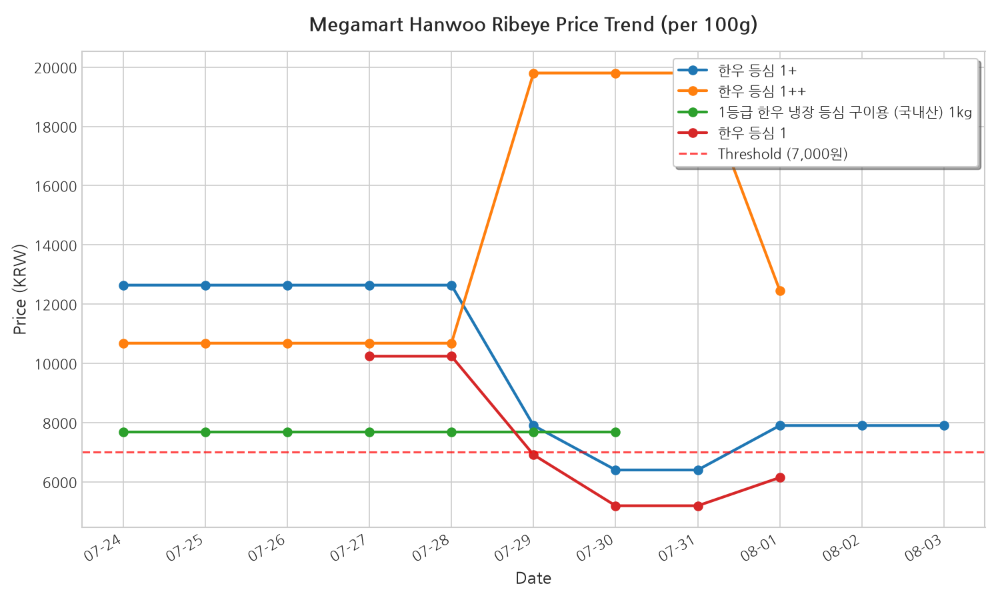

# Naver Booking & Megamart Price Monitor

이 저장소는 네이버 예약 및 메가마트 가격 감시 모니터링 시스템을 위한 자동화 저장소입니다.

---

## 🥩 메가마트 한우 등심 100g 가격 실시간 추이
* **설정 가격 기준**: 100g 당 **7,000원 이하**일 때 이메일 알림 발송

### 📌 최근 수집된 가격
- **한우 등심 1+등급 구이용 (국내산) 100g**: 100g당 7,900원 (현재 판매가: 7,900원/100g) (업데이트: 2026-08-03)

### 📈 가격 추이 그래프

---

## 📅 네이버 예약 모니터링 (애슐리퀸즈 여의도한강공원점)
* **대상 일자**: 2026년 8월 15일 광복절
* **동작 방식**: 예약이 열리는 즉시 이메일 발송 후 감시가 자동으로 종료됩니다.
